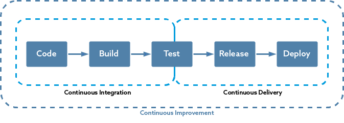
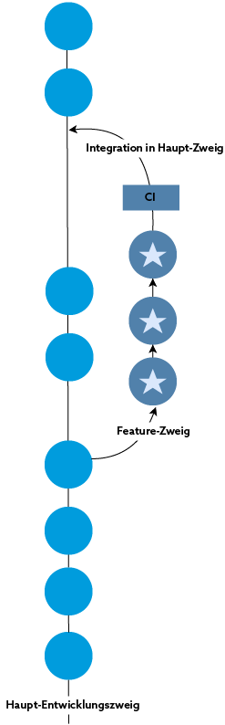

# Evaluation

## OAuth (over Keycloak) with RabbitMQ

## MiniCube

## Kubernetes

### Load Balancing

### Resilience
(Which tools are)

### Blue-green deployment

### Datenbank in Kubernetes

### Keycloak in Kubernetes

### RabbitMQ in Kubernetes

## CI/CD-Pipeline (GitHub Actions)

Continous Integration and Deployment is an essential component to effectively and reliably publish an application, especially to a container platform. By using these practices, a clean deployment can be guaranteed.

